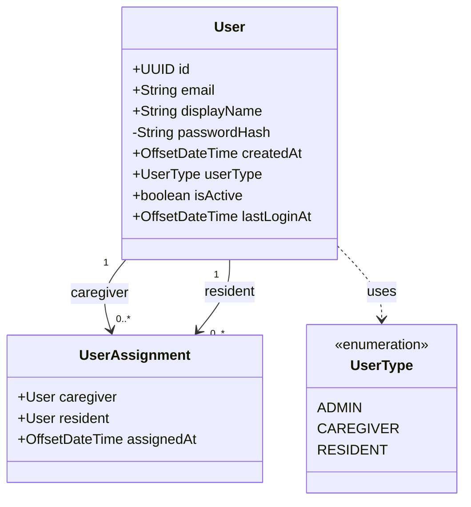

# MoS Project - Authentication System Session Summary

## 🎯 **Session Goals Achieved**
- ✅ Implemented complete JWT-based authentication system
- ✅ Created user management foundation with roles and relationships
- ✅ Fixed Docker UI loading issues
- ✅ Resolved Maven clean plugin errors for Windows/OneDrive
- ✅ Added CORS support for frontend integration
- ✅ Committed all changes to `users` branch

## 🏗️ **Key Components Built**

### Authentication System
- **AuthenticationController**: Login/logout endpoints with JWT tokens
- **JwtUtil**: Token generation, validation, and parsing utilities
- **JwtSecurityConfig**: JWT-based security configuration
- **JwtAuthenticationFilter**: Token validation filter for requests
- **Endpoints**:
  - `POST /api/auth/login` - User authentication
  - `GET /api/auth/me` - Current user info (requires Bearer token)
  - `POST /api/auth/logout` - Logout (client-side token removal)

### User Management Foundation
- **User Entity Extensions**: userType, isActive, lastLoginAt fields
- **UserAssignment Entity**: Caregiver-resident relationship management
- **UserType Enum**: ADMIN, CAREGIVER, RESIDENT roles
- **Enhanced UserRepository**: Authentication queries and user filtering

### Database Schema
- **V4 Migration**: Added user management fields and relationships
- **V5 Migration**: Removed duplicate relationships (bug fix)
- **Clean Architecture**: Single source of truth for user relationships

## 🔧 **Technical Decisions**
- JWT tokens with 24-hour expiration
- BCrypt password hashing
- Role-based access control ready
- Composite primary keys for user assignments
- CORS enabled for localhost:3000 frontend

## 🐛 **Issues Resolved**
- **Docker UI Loading**: Fixed Rollup dependency issues and Vite configuration
- **Maven Clean Errors**: Added retry logic and failOnError=false for Windows/OneDrive
- **Duplicate Relationships**: Removed redundant User entity relationships
- **JWT Library**: Fixed parser() vs parserBuilder() compatibility issues

## 📁 **Files Created/Modified**

### New Files
```
backend/src/main/java/com/attendo/mos/
├── config/
│   ├── JwtAuthenticationFilter.java
│   ├── JwtSecurityConfig.java
│   └── JwtUtil.java
├── controller/
│   └── AuthenticationController.java
└── dto/
    ├── LoginRequest.java
    ├── LoginResponse.java
    └── UserInfoResponse.java

backend/src/main/resources/db/migration/
├── V4__add_user_management.sql
└── V5__remove_duplicate_relationships.sql
```

### Modified Files
```
backend/
├── pom.xml (JWT dependencies)
├── src/main/java/com/attendo/mos/
│   ├── entity/User.java (user management fields)
│   ├── repo/UserRepository.java (authentication queries)
│   └── config/SecurityDevConfig.java (disabled old auth)
├── src/main/java/com/attendo/mos/controller/
│   ├── ReminderController.java (CORS added)
│   └── MealRequirementController.java (CORS added)
└── frontend/
    ├── Dockerfile (fixed Rollup issues)
    └── vite.config.js (Docker container access)
```

## 🚀 **Current Status**
- ✅ Backend running successfully with JWT authentication
- ✅ Frontend accessible at http://localhost:3000
- ✅ Database migrations applied (V1-V5)
- ✅ All changes committed to `users` branch
- ✅ CORS configured for frontend integration

## 🔐 **Security Features Implemented**
- JWT token-based authentication
- Password hashing with BCrypt
- Role-based access control (ADMIN, CAREGIVER, RESIDENT)
- Active user validation
- Token expiration handling
- CORS protection

## 📊 **Updated Class Diagram**


## 🚀 **Next Steps Available**
1. **Create test users** for development and testing
2. **Implement role-based permissions** on existing endpoints
3. **Add user management APIs** (admin functions)
4. **Frontend authentication integration**
5. **Password reset functionality**
6. **User assignment management**

## 💡 **Key Learnings**
- Docker volume mounting strategies for development
- JWT library version compatibility issues
- Database relationship modeling best practices
- Windows/OneDrive Maven integration challenges
- Composite primary keys in JPA entities

## 🎯 **Git Information**
- **Branch**: `users`
- **Commit**: `eb3b2bf` - "Implement JWT-based authentication system"
- **Files Changed**: 11 files, 407 insertions, 10 deletions
- **Status**: All changes committed and pushed

---
*Session completed: Authentication system ready for frontend integration and user management features*
